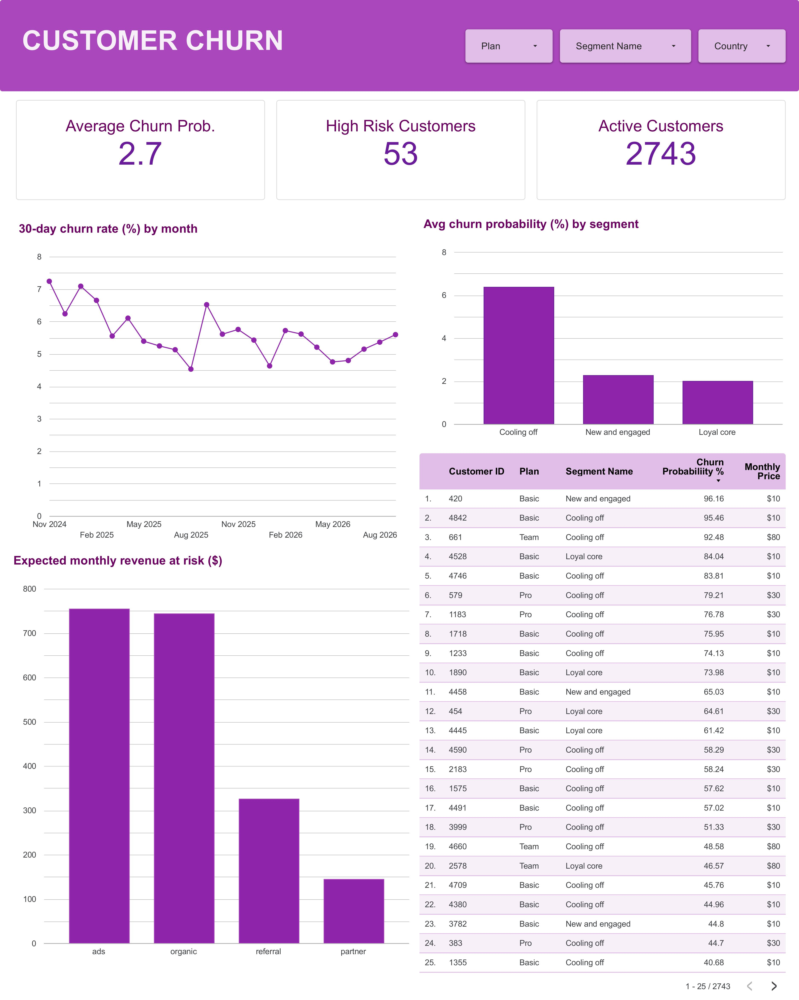

# End-to-End Customer Churn Prediction & Risk Segmentation Pipeline

An enterprise-ready machine learning and analytics system designed to predict customer churn, perform behavioral clustering, and push real-time actionable insights to PostgreSQL and Data Studio (Looker Studio).

---

## Executive Summary

* **Business Value:** Enables proactive retention strategies by identifying high-risk, high-value customers before they churn, directly targeting revenue at risk across acquisition channels.
* **Architecture:** Automated Python data pipeline running data quality checks, database materialized view refreshes, model training, K-Means clustering, and automated dashboard exports.
* **Core Stack:** Python (`scikit-learn`, `pandas`, `psycopg`), PostgreSQL, Parquet, Data Studio.

---

## System Architecture & Workflow


```

PostgreSQL (DB) ──> Extract & Split ──> Scikit-Learn (Train/Score) ──> K-Means (Segmentation) ──> PostgreSQL Update ──> CSV Export ──> Data Studio

```

The pipeline executes five core sequential modules managed by an automated orchestrator:

1. **Quality Checks (`quality_checks.py`):** Runs automated validations on raw customer data before execution.
2. **Feature Refresh & Extraction (`extract_features.py`):** Refreshes the `analytics.customer_snapshots` materialized view and extracts training, testing, and scoring sets using time-based splitting into optimized `.parquet` format.
3. **Model Training & Scoring (`train_churn.py`):**
   * Trains **Logistic Regression** and **HistGradientBoostingClassifier** models inside `scikit-learn` Pipelines with built-in median imputation and scaling.
   * Evaluates models using **ROC-AUC**, **PR-AUC**, and **Top-Decile Lift**.
   * Computes permutation feature importances and upserts churn predictions directly to PostgreSQL (`analytics.churn_scores`).
4. **Behavioral Segmentation (`segment.py`):**
   * Applies `log1p` transformation and standard scaling to behavior features (recency, frequency, LTV, tenure).
   * Evaluates cluster quality across $k \in [3, 8]$ using **Silhouette Scores** to select optimal $k$.
   * Profiles segment personas (`Cooling Off`, `New and Engaged`, `Loyal Core`) and writes cluster IDs back to the database.
5. **Dashboard Export (`export_for_looker.py`):** Formats date columns and exports processed customer risk profiles and historical churn trends to `/exports` for Data Studio (Looker Studio) ingestion.

---

## Analytics & BI Dashboard

The Data Studio dashboard provides real-time monitoring for Customer Success and Retention teams:

- **Executive Key Metrics:** Tracks Overall Churn Rate, High-Risk Customer Counts, and Active Subscriptions.
- **Risk Segmentation:** Highlights high-risk segments (e.g., *Cooling Off* group averaging elevated churn probability).
- **Revenue Exposure:** Analyzes expected monthly revenue at risk broken down by acquisition channel (Ads, Organic, Referral, Partner).
- **Actionable High-Risk Roster:** Itemized customer-level drill-down with churn probabilities for immediate retention outreach.

[](https://datastudio.google.com/s/ozEe8s6XuZc)
*Click the preview above to view the dashboard interface.*

---

## Getting Started

### Prerequisites

* Python 3.10+
* PostgreSQL database instance running locally or remotely

### Environment Setup

1. **Clone the repository:**
   ```bash
   git clone https://github.com/ChikamsoChidi/Churn-Prediction-Pipeline.git
   cd churn-prediction-pipeline

    ```

2. **Set up virtual environment:**
    ```bash
    python -m venv venv
    source venv/bin/activate  # On Windows: venv\Scripts\activate
    pip install -r requirements.txt

    ```


3. **Configure Environment Variables:**
Create a `.env` file in the root directory:
    ```env
    DATABASE_URL="........."

    ```


4. **Run the End-to-End Pipeline:**
    ```bash
    python scripts/run_pipeline.py

    ```


---

## 📁 Repository Structure

```text
├── scripts/
│   ├── quality_checks.py       # Automated data quality checks
│   ├── extract_features.py     # Database extraction and temporal splitting
│   ├── train_churn.py          # ML modeling, evaluation, and DB upserts
│   ├── segment.py              # K-Means clustering & persona profiling
│   └── export_for_looker.py    # Data Studio CSV export generator
├── data/                       # Local Parquet storage (Git ignored)
├── exports/                    # Processed CSV exports for BI tools
├── run_pipeline.py             # Orchestrator script for full pipeline execution
├── requirements.txt            # Python dependencies
└── README.md                   # Project documentation

```

